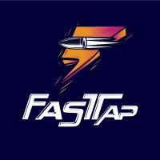
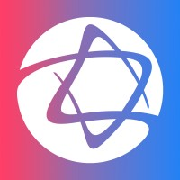

## Capyba
- *Senior Software Engineer* | Oct'21 - Today
- 
- Tags: Capyba
- Badges:
  - ReactJs [blue]
  - NestJs [blue]
  - Laravel [blue]
  - Flutter [blue]
  - AWS [blue]
  - Kafka [blue]
  - Java [blue]
  - Dokku [blue]
  - DJANGO [blue]
  - MySQL [blue]
  - MongoDB [blue]
  - Postgres [blue]
  - Firebase [blue]
- List Items:
  - Tech Leader in Brazilian and American projects.
  - Development of microservices.
  - Maintenance of an eduTech application with more than 1 million downloads in Flutter.
  - Migrating legacy frontends with micro-frontends with ReactJs
  - Team coordination.
  - Coordination of software projects.
  - Development of good development practices and projects.

## FastTap
- *CTO & Co-Founder* | Jun'20 - Jun'23
- 
- Tags: FastTap
- Badges:
  - ReactJs [blue]
  - NodeJs [blue]
  - Oracle Cloud [blue]
  - Digital Ocean [blue]
  - SSO [blue]
  - Firebase [blue]
  - MySQL [blue]
  - Sockets [blue]
- List Items:
  - FastTap was a competitive CSGO platform, based on microservices architecture, bringing functionality for lobbies, friendships, championships, and player performance monitoring through ranks, individual and collective gameplay statistics.
  - I started as an all-in-one developer on the platform during the development of its first MPV, then I worked in front of the startup's technology sector, performing technical leadership and CTO work when a team joined to help with development.
  - We created a project called DevFast, where we trained young people from the CSGO community who wanted to become programmers, providing them with knowledge and their first market experience.

## Escala
- *Mid-Level Software Engineer* | Oct'20 - Oct'21
- 
- Tags: Escala
- Badges:
  - Laravel [blue]
  - React Native [blue]
  - ReactJs [blue]
  - Angular [blue]
  - MySQL [blue]
- List Items:
  - Development of multitenancy applications
  - Production support for the largest hospital networks in Brazil such as Albert Einstein Hospital
  - Implementation of microfrontends with Angular and ReactJs
  - Development of Resta API with Laravel
  - Mobile application development with React Native

## Hospital Israelita Albert Einstein
- *Mid-Level Application Analyst* | Oct'20 - Oct'21
- 
- Tags: Albert Einstein
- Badges:
  - Laravel [blue]
  - React Native [blue]
  - ReactJs [blue]
  - Angular [blue]
  - MySQL [blue]
- List Items:
  - Working as a front-end and back-end developer at HR Tech Escala, born in the Innovation Laboratory of Hospital Israelita Albert Einstein.

## Incodde
- *Entry-Level Software Engineer* | Apr'20 - Oct'20
- 
- Tags: Incodde
- Badges:
  - NodeJS [blue]
  - React Native [blue]
  - ReactJs [blue]
  - Flutter [blue]
  - MySQL [blue]
  - MongoDB [blue]
- List Items:
  - I worked in a software factory where I had the opportunity to create web and mobile applications for customers in different sectors, during the period I developed services for the area of health, entertainment, sales and finance.
